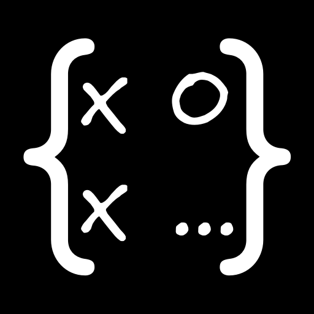
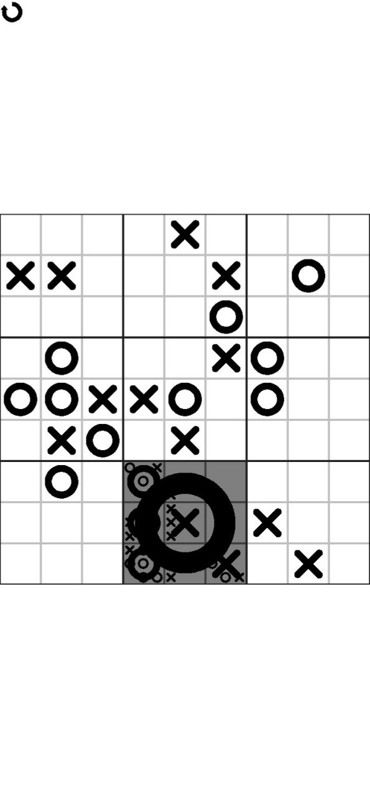

# Recursive Tic-Tac-Toe

This app is a recursive version of the popular Tic-Tac-Toe (also known as Xs and Os) game I wrote in ~3 days, based on the [Ultimate Tic-Tac-Toe](https://en.wikipedia.org/wiki/Ultimate_tic-tac-toe) game.

Or download the latest APK from the [Releases Section](https://github.com/Kirkezz/rttt/releases/latest).

The code is based on [Kirkezz/TicTacToeNxNSFML](https://github.com/Kirkezz/TicTacToeNxNSFML) and contains many parts with code of questionable quality. I'll probably rewrite it when I have time.
The game supports customization of the width and height of the playing field, the victory condition, and the number of players.

