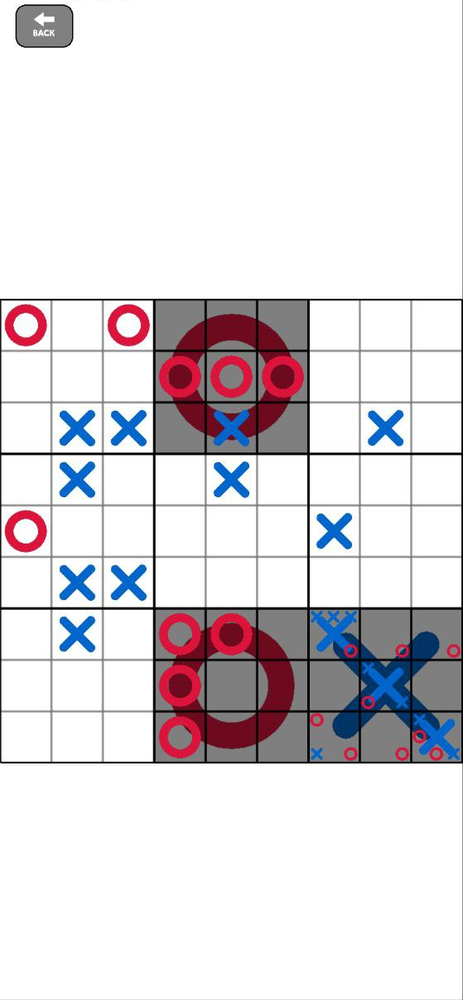

<p align="center">
  <a href="https://github.com/kirkezz/rttt" target="_blank" rel="noopener noreferrer">
    <picture>
      <source media="(prefers-color-scheme: dark)" srcset="https://github.com/kirkezz/rttt/raw/master/logo.png">
      
    </picture>
  </a>
</p>

<h1 align="center"/>RTTT</h1>

<p align="center">
    Recursive Tic-Tac-Toe game
</p>

# Overview

This app is a recursive version of the popular Tic-Tac-Toe (also known as Xs and Os) game I wrote in ~3 days, based on the [Ultimate Tic-Tac-Toe](https://en.wikipedia.org/wiki/Ultimate_tic-tac-toe) game.
In version 1.3, the project has been refactored and is now based on SDL3 and [sdl3-example](https://github.com/Ravbug/sdl3-sample) for better portability. Also [RmlUI](https://github.com/mikke89/RmlUi) is now used for the interface.

[](https://f-droid.org/fr/packages/org.kirkezz.rttt/)
<a href="https://github.com/Kirkezz/rttt/releases/latest">
  
</a>

The code is based on [Kirkezz/TicTacToeNxNSFML](https://github.com/Kirkezz/TicTacToeNxNSFML) and contains many parts with code of questionable quality. I will rewrite it when I have time. Multiplayer is planned.
The game supports customization of the width and height of the playing field, the victory condition, and the number of players.

## Building and Running

For more detailed instructions, visit [sdl3-sample Wiki](https://github.com/Ravbug/sdl3-sample/wiki/Setting-up-your-computer).

```sh
git clone https://github.com/kirkezz/rttt --depth=1 --recurse-submodules
cd rttt
cmake -S . -B build
```

For Android, `cd SDL/android-project/' and run './gradlew assembleDebug'.



## Support the Development

If you found this game interesting and would like to support the development of it or my other projects, you can make a donation: https://github.com/kirkezz/kirkezz
To contact me, create an issue or find my contacts on my GitHub profile..
